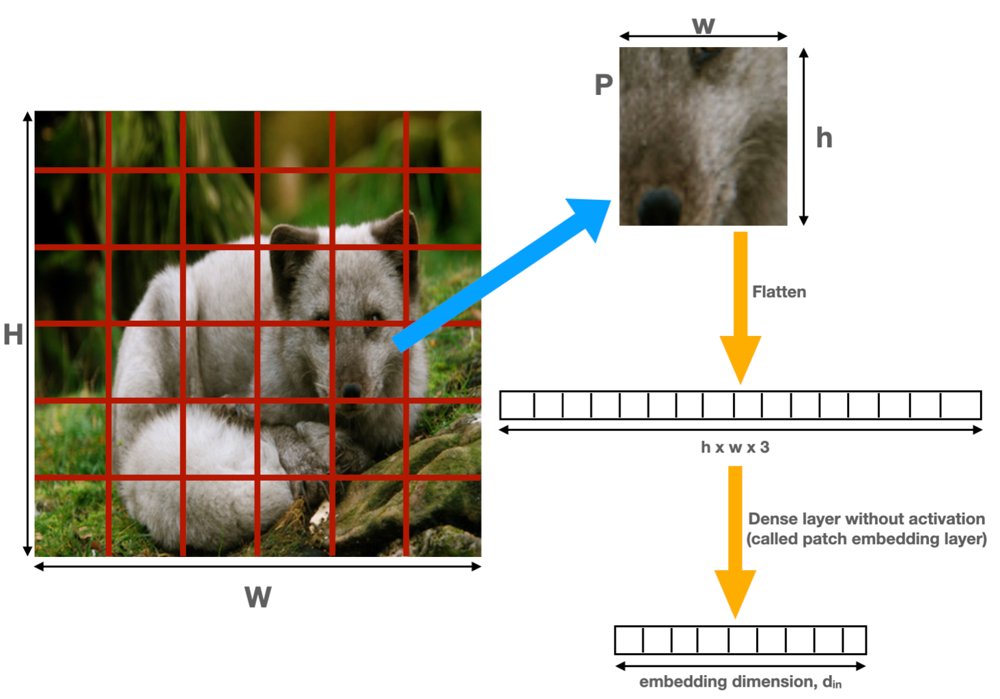
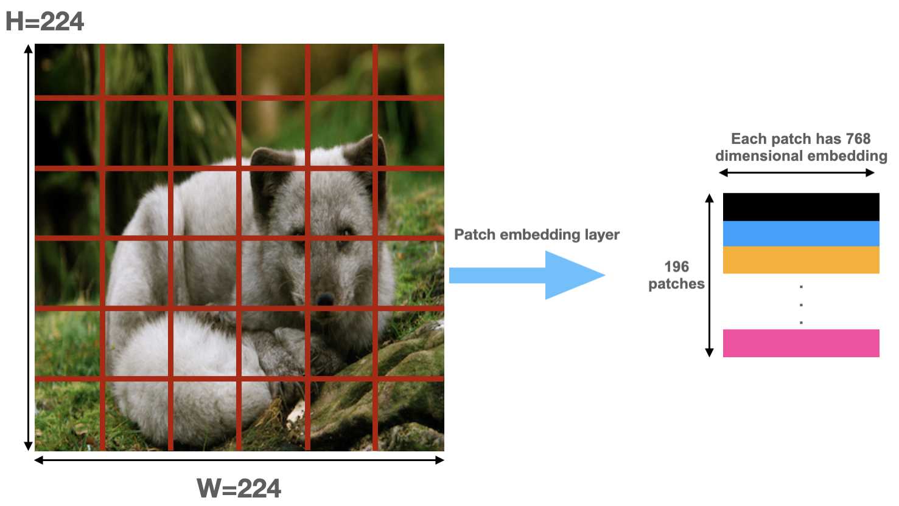
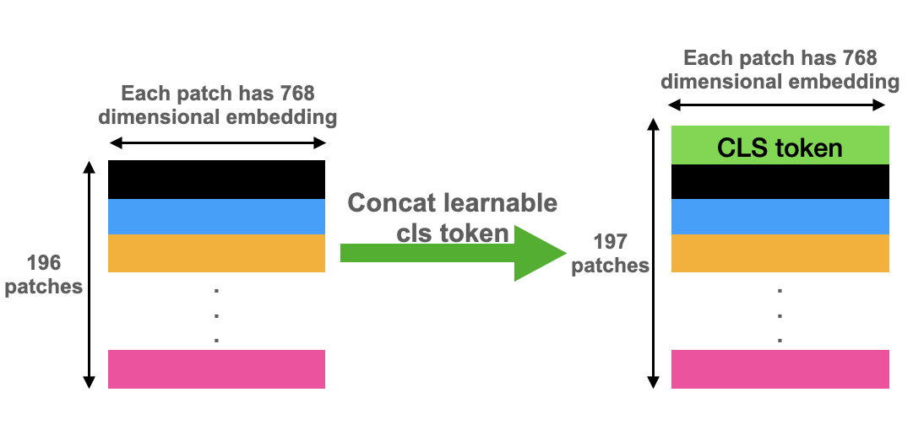
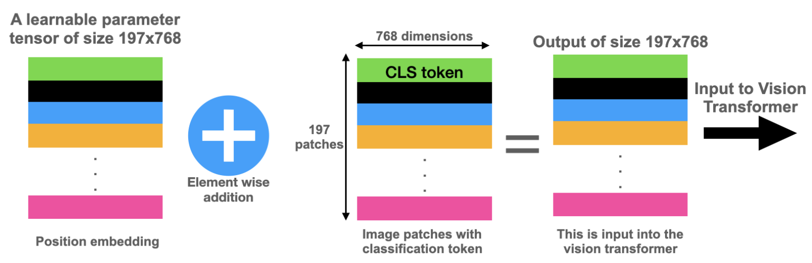

# Vision Transformer: A pytorch Implementation

## What is a Vision Transformer?

A Vision Transformer, also known as ViT, is a type of deep learning architecture specifically designed for visual recognition tasks, such as image classification. It was introduced in a research paper titled [An Image is Worth 16x16 Words: Transformers for Image Recognition at Scale](https://arxiv.org/pdf/2010.11929.pdf) published by Dosovitskiy et al. in 2020.

Vision Transformers (ViTs) are based on the Transformer architecture which was originally developed for natural language processing (NLP) tasks. However, ViTs make some key changes to the Transformer architecture to make it better suited for image processing.

the key reasons for the success of transformers are:

1. Multi Headed Self attention layers
2. Use of Layer normalization rather than batch normalization
3. Scaling the attention matrix to improve gradient flow.
4. Residual connections in the ender and decoder layers, and
5. Presence of cross attention between encoder and decoder layers.

## The Vision Transformer And Its Components

### Patch Embeddings

### Classification Token

